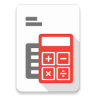

 Bill-Calculator
===============

Android app to calculate bill value for PGE, PGNiG and Tauron providers.

With help of
---------
- [Butter Knife](https://github.com/JakeWharton/butterknife)
- [Dart](https://github.com/f2prateek/dart)
- [EventBus](https://github.com/greenrobot/EventBus)
- [GreenDao](http://greendao-orm.com/)
- [Hrisay](https://github.com/mg6maciej/hrisey)
- [ITEXTG](http://itextpdf.com/product/itextg)
- [ThreeTenABP] (https://github.com/JakeWharton/ThreeTenABP)
- [Hugo](https://github.com/jakewharton/hugo)
- [LeakCanary](https://github.com/square/leakcanary)
- [Crashlytics](https://fabric.io)
- [Stetho](http://facebook.github.io/stetho)
- [Espresso](https://code.google.com/p/android-test-kit/wiki/Espresso)
- [Mockito](http://mockito.org)
- [JUnitParams](https://github.com/Pragmatists/junitparams)
- [Robotium] (https://code.google.com/p/robotium)